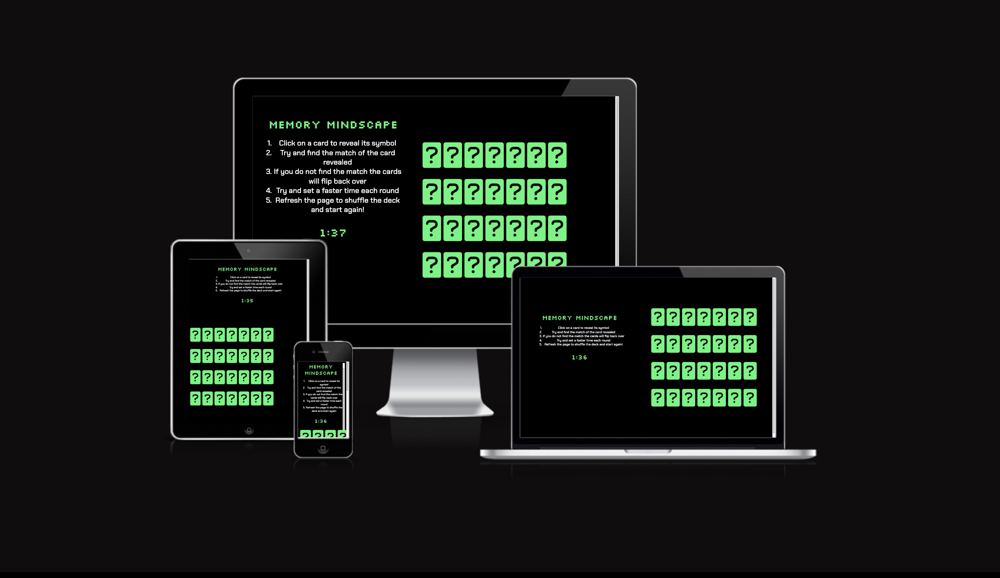
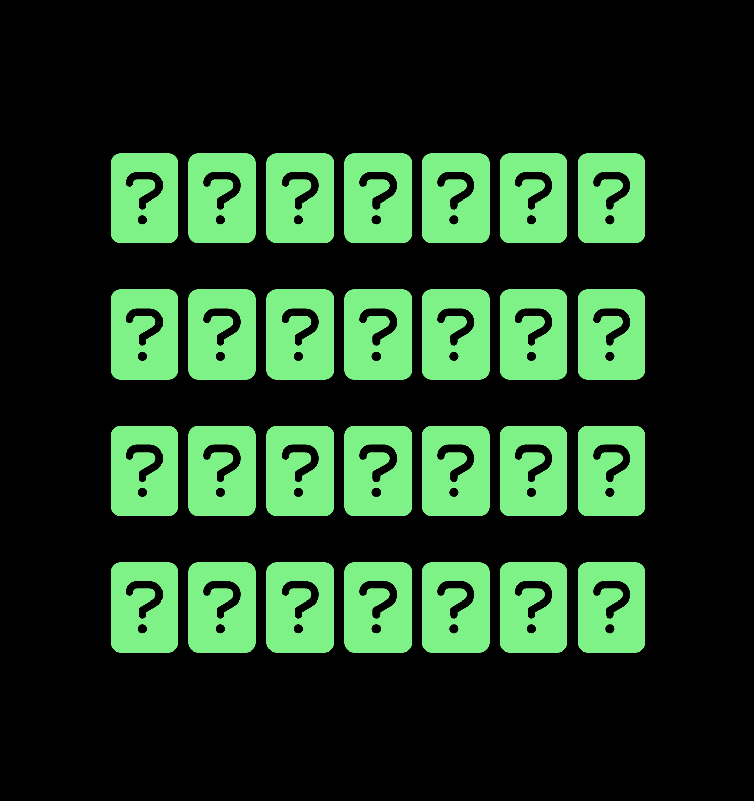
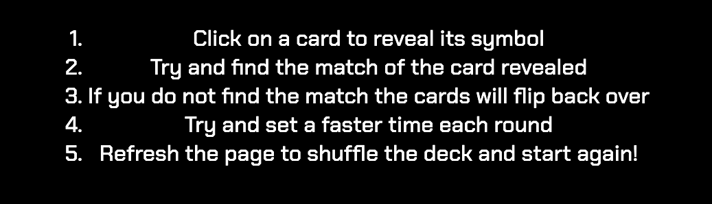

# Memory Mindscape

Memory Mindscape utilises Javascript to allow the user to participate in a fun and interactive memory game. The site is targeted at people who want to test themselves mentally.

The site has been designed to look and feel "retro", this effect was achiveved by using pixelated font and a black and green color scheme much like the old green phosphorus monochrome computer screens.

## Features

### Memory Mindscape Heading
- The Memory Mindscape heading is featured on the left side of the screen, utilising a bright green color and a different font from the "rules" section, it clearly defines itself as a heading and the name of the game. The name is also featured in the tab at the top of the page to furthermore reiterate the game's name.

### Game Container
- This section allows the user to interact with and participate in the game. The user can select a card, watch it flip over and try and find the matching pair, failure to do so will result in both cards simultaneuosly flippng back over where now the user can go again.
- This process is repeated until the user matches all pairs.

### The Rules section
- In this section the user will be able to quickly understand how the game is played and what they must do to achieve a victory.

### The Countdown Timer
- The Countdown Timer aims to bring about a sense of urgency and difficulty to the game.
- The timer is located directly underneath the "rules" section and is styled the same way as the heading to allow for it to stand out be easily readable.

### Features Left to Implement
- A feature I believe that would add to the overall user experience for this game would be a "shuffle" function where the user can click a button and it will shuffle the deck, currently the method to restart and "shuffle" the deck is to refresh the page which will randomise the deck each time and reset the clock.
- I would also like to implement a score tracker alongside the "shuffle" button so that the user can see they're current fastest time and attempt to beat that record.

## Testing
- Mentioned below is a list of tasks that my Javascript must execute in order for the game to work accordingly.

- [x] Before the game starts is there an alert to allow the user some basic knowledge of the game.
- [x] Does the timer countdown from 2:00 after the user has clicked out of the alert.
- [x] Does the game stop the user from flipping over more than two cards in one turn.
- [x] When the user clicks on a card does the card "flip" over to reveal a symbol.
- [x] When the user clicks on the second card and it is a match does it remain flipped over.
- [x] When the user clicks on the second card and it is not a match do both cards simultaneously flip back over.

### Responsivity of my site
- [x] I have tested that this site works in different browsers.
- [x] Utilising media queries I have tested to ensure that this site is viable across multiple screen sizes, as you can see in the first image of this README it shows a screenshot of the site being displayed on deivces with different viewports

### Navigation
- [x] Due to the site only needing a single page navigation is simple as everything the user needs is on the main page.

### Problems that arose and how they were overcome
#### The Issues
 1. The game container had the cards all spread out across one row resulting in a very awkward and unplayable game.
 2. The game container overflowed out of the set height of the container.
 3. During the site responsivity testing the mobile and tablet display vieport had a horizontal scroll bar issue.
 
#### The solution
1. I had forgotten one simple but very important component and that was to add a `flex-wrap:wrap;` to the game-container which resulted in the desired layout.
2. To solve this I played around with the calculated width and height percentages to negate the overflow and also have a even container e.g all the rows having the same amount of cards.
3. I researched online and saw that some simple styling code `html, body {max-width: 100%;overflow-x: hidden;}` solved the horizontal scrolling issue.

